# sci-wolfram

**Author:** Peng Peng  \
**Email:** [211110103110@stu.just.edu.cn](mailto:211110103110@stu.just.edu.cn)  \
**GitHub:** [TurbulenceChaos/sci-wolfram](https://github.com/TurbulenceChaos/sci-wolfram)

---

# Table of contents
- [sci-wolfram](#sci-wolfram)
- [Table of contents](#table-of-contents)
- [Introduction](#introduction)
- [Features](#features)
  - [Features for emacs](#features-for-emacs)
  - [Features for vscode](#features-for-vscode)
- [Installation for emacs](#installation-for-emacs)
  - [Prerequisites](#prerequisites)
  - [Configuration](#configuration)
- [Usage for emacs](#usage-for-emacs)
  - [For wolfram script file](#for-wolfram-script-file)
  - [For `jupyter-Wolfram-Language` src-block in org-mode](#for-jupyter-wolfram-language-src-block-in-org-mode)
- [Installation for vscode](#installation-for-vscode)
  - [Prerequisites](#prerequisites-1)
  - [Configuration](#configuration-1)
- [Usage for vscode](#usage-for-vscode)
  - [For repl](#for-repl)
  - [For wolframscript command line](#for-wolframscript-command-line)
  - [Convert wolfram script to pdf and notebook](#convert-wolfram-script-to-pdf-and-notebook)
- [Reference](#reference)

---
# Introduction
An all-in-one wolfram package for emacs.

Display wolfram script images in vscode terminal.

# Features
## Features for emacs
- [x] Automatically read wolfram symbols from built-in `LSPServer` package and convert them to emacs variables.
- [x] Add wolfram symbols to `completion-at-point` when lsp server is not available;
- [x] Use `CodeFormatter` to format code when lsp server is not available;
- [x] Add `LSPServer` to `eglot` or `lsp-mode` to support code formatting and completion;
- [x] Execute wolfram script and display images and latex in tmp buffer;
- [x] Convert wolfram script to pdf and Mathematica notebook, and use `Wolfram Player` to view notebook;
- [x] `jupyter-Wolfram-Language` src-block in org-mode: find doc, `completion-at-point`, format, convert to pdf and notebook;
- [x] Send wolfram script to jupyter repl, and display images in it;
- [x] Insert `sci-wolfram-image.wl` package based on your emacs config;
- [ ] Execute wolfram script based on `jupyter-eval` when jupyter repl is started;
- [x] Add more wolfram symbols to font-lock-keywords.
- [x] Add prettify symbols to `sci-wolfram-mode` 

## Features for vscode
- [x] Display wolfram script images in vscode terminal using `imgcat`;
- [x] Convert wolfram script to pdf and Mathematica notebook, and use `Wolfram Player` to view notebook; 

# Installation for emacs
## Prerequisites
- **`wolframscript`** (free) and **`Wolfram Engine`** (free), or **`Mathematica`** (already include `wolframscript`)\
Required for executing wolfram scripts, which can be downloaded from https://www.wolfram.com/download-center/index.php.en 
- **`Wolfram Player`**\
Needed for viewing Mathematica notebook and `.cdf` files.\
Both `Wolfram Engine` and `Mathematica` already include `Wolfram Player`, so you don't need to install it manually.
- [Jupyter](https://jupyter.org/install)
- [WolframLanguageForJupyter](https://github.com/WolframResearch/WolframLanguageForJupyter)\
Note: The latest version until 20/05/2025 is [9a26ac78743cc47084c9c99ff75c5aee2657a409](https://github.com/WolframResearch/WolframLanguageForJupyter/tree/9a26ac78743cc47084c9c99ff75c5aee2657a409), where images can not be shown in emacs jupyter-repl. See this [issue](https://github.com/emacs-jupyter/jupyter/issues/223#issuecomment-927137191).\
You need to download the wolfram jupyter repository and manually modify the `WolframLanguageForJupyter/Resources/RequestHandlers.wl` file according to this [commit](https://github.com/linux-xhyang/WolframLanguageForJupyter/commit/2a4ed08556a3f87e4b134b48d5b0bc44bc81fb8b)
- [emacs-jupyter](https://github.com/emacs-jupyter/jupyter)\
Note: The latest version until 20/05/2025 is [3615c2de16988c4dd9d1978bfa10ee3092e85b33](https://github.com/emacs-jupyter/jupyter/tree/3615c2de16988c4dd9d1978bfa10ee3092e85b33), where `completion-at-point` function does not work in jupyter org-block, see this [pull request](https://github.com/emacs-jupyter/jupyter/pull/582).\
You have to overwrite the original `jupyter-org--set-src-block-cache` function manually. See my emacs config [sci-emacs](https://github.com/TurbulenceChaos/sci-emacs/blob/main/lisp/init-emacs-jupyter.el) for ref.
- [LaTeX](https://orgmode.org/manual/Previewing-LaTeX-fragments.html) (optional)\
In linux, you can install it using `sudo apt install texlive-full` to preview latex fragments in org-mode.

## Configuration
```lisp
(require 'package)
(setq package-archives '(("melpa" . "https://melpa.org/packages/")
			 ("gnu" . "https://elpa.gnu.org/packages/")
                         ("nongnu" . "https://elpa.nongnu.org/nongnu/")))
(package-initialize)
(when (not package-archive-contents)
  (package-refresh-contents))

;; emacs-jupyter
(unless (package-installed-p 'jupyter)
  (package-install 'jupyter))

;; org-mode
(setq org-babel-min-lines-for-block-output 100)

(org-babel-do-load-languages
 'org-babel-load-languages
 '((emacs-lisp . t)
   (jupyter . t)))

;; for emacs 29+, you can use `package-vc-install' to install packages from github
(unless (package-installed-p 'sci-wolfram)
  (package-vc-install "https://github.com/TurbulenceChaos/sci-wolfram"))

;; or you can manually download the package and add it to `load-path'
;; (add-to-list 'load-path "/path/to/sci-wolfram")
;; (require 'sci-wolfram)
;; (require 'sci-wolfram-jupyter)

;; to customize all configurable variables of `sci-wolfram' package,
;; just type M-x customize-group RET sci-wolfram-mode
```
# Usage for emacs
The default leader key of `sci-wolfram` is `F6`.

## For wolfram script file
`completion-at-point`

demo: [sci-wolfram-completion-at-point-emacs-script-file.gif](https://github.com/TurbulenceChaos/sci-wolfram/blob/main/Images/gif/sci-wolfram-completion-at-point-emacs-script-file.gif)

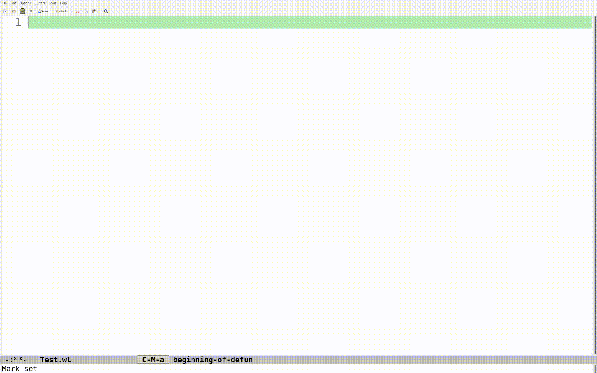

`sci-wolfram-prettify-symbols` (toggle with M-x `prettify-symbols-mode`)

demo: [sci-wolfram-prettify-symbols-emacs-script-file.gif](https://github.com/TurbulenceChaos/sci-wolfram/blob/main/Images/gif/sci-wolfram-prettify-symbols-emacs-script-file.gif)

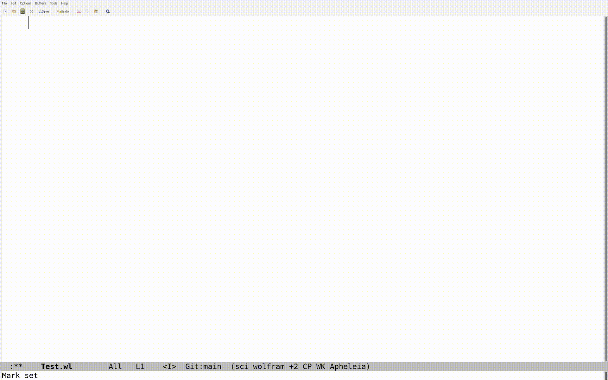

`sci-wolfram-format-region-or-buffer`

demo: [sci-wolfram-format-region-or-buffer-emacs-script-file.gif](https://github.com/TurbulenceChaos/sci-wolfram/blob/main/Images/gif/sci-wolfram-format-region-or-buffer-emacs-script-file.gif)

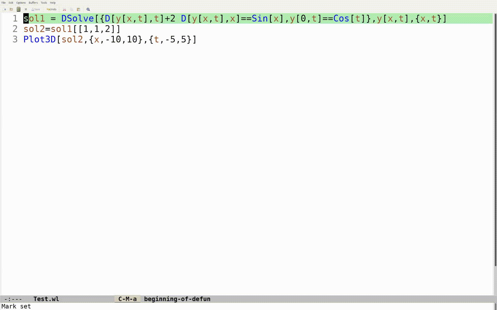

`sci-wolfram-doc-lookup` (forked from `xah-wolfram-mode`)

demo: [sci-wolfram-doc-lookup-emacs-script-file.gif](https://github.com/TurbulenceChaos/sci-wolfram/blob/main/Images/gif/sci-wolfram-doc-lookup-emacs-script-file.gif)


`eglot` or `lsp-mode`

demo: [sci-wolfram-lsp-server-emacs-script-file.gif](https://github.com/TurbulenceChaos/sci-wolfram/blob/main/Images/gif/sci-wolfram-lsp-server-emacs-script-file.gif)

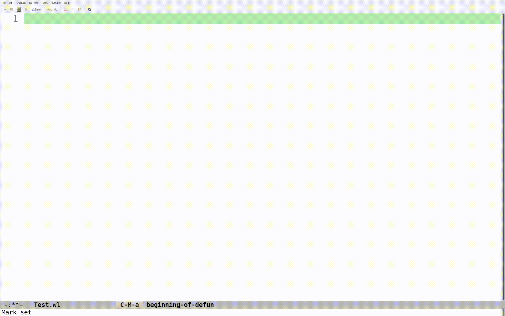

`sci-wolfram-eval-region-or-buffer`

demo: [sci-wolfram-eval-region-or-buffer-emacs-script-file.gif](https://github.com/TurbulenceChaos/sci-wolfram/blob/main/Images/gif/sci-wolfram-eval-region-or-buffer-emacs-script-file.gif)

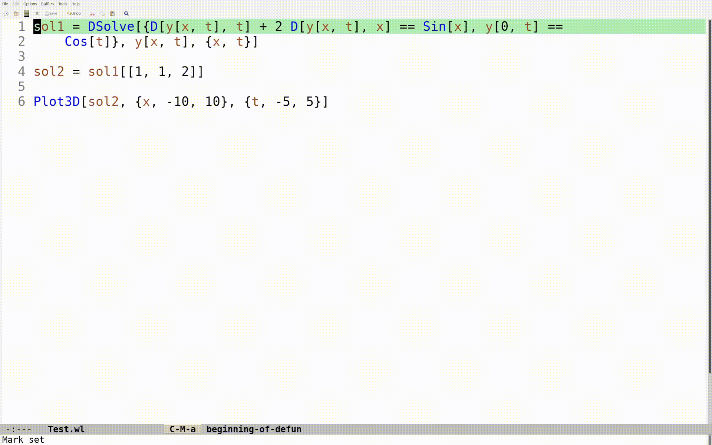

`sci-wolfram-jupyter-eval-region-or-buffer`

demo: [sci-wolfram-jupyter-eval-region-or-buffer-emacs-script-file.gif](https://github.com/TurbulenceChaos/sci-wolfram/blob/main/Images/gif/sci-wolfram-jupyter-eval-region-or-buffer-emacs-script-file.gif)

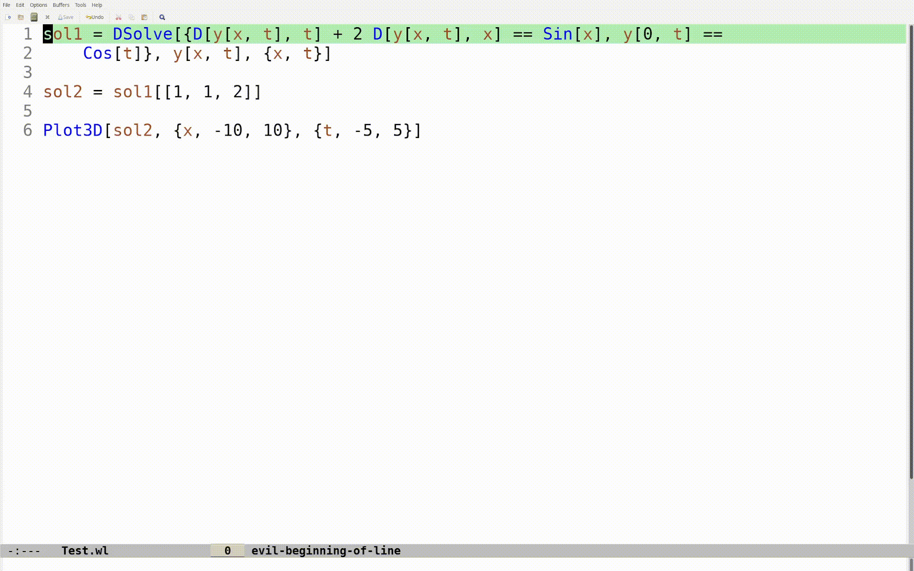

`sci-wolfram-convert-region-or-buffer-to-pdf-and-notebook`

demo: [sci-wolfram-convert-region-or-buffer-to-pdf-and-notebook-emacs-script-file.gif](https://github.com/TurbulenceChaos/sci-wolfram/blob/main/Images/gif/sci-wolfram-convert-region-or-buffer-to-pdf-and-notebook-emacs-script-file.gif)

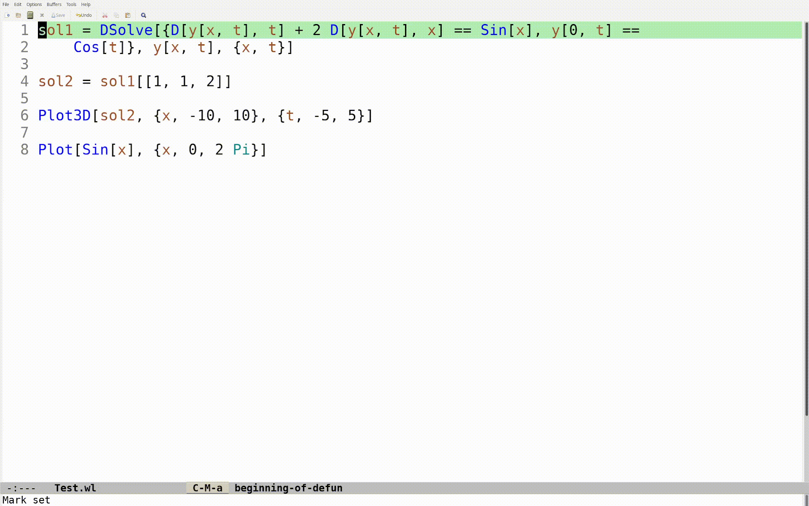

A more complex case to add title, subtitle, section, text, etc., using `TextCell` (can include formulas):

demo: [sci-wolfram-convert-region-or-buffer-to-pdf-and-notebook-emacs-script-file-complex-case.gif](https://github.com/TurbulenceChaos/sci-wolfram/blob/main/Images/gif/sci-wolfram-convert-region-or-buffer-to-pdf-and-notebook-emacs-script-file-complex-case.gif)

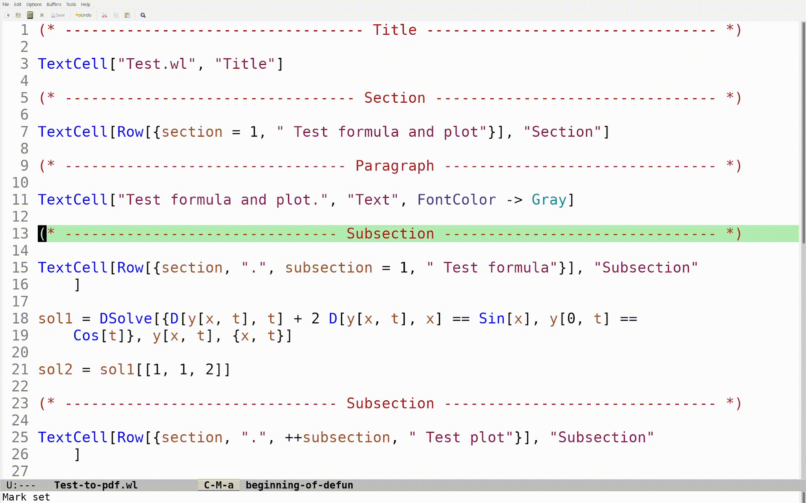

## For `jupyter-Wolfram-Language` src-block in org-mode
`org-babel-execute-code`

For emacs org-mode, formulas can be converted into LaTeX fragments, making it easy to paste them into Microsoft Word or LaTeX documents.

You can place the cursor on a formula and run `org-latex-preview` command to  preview LaTeX fragments.

demo: [sci-wolfram-org-babel-execute-code-emacs-org-block.gif](https://github.com/TurbulenceChaos/sci-wolfram/blob/main/Images/gif/sci-wolfram-org-babel-execute-code-emacs-org-block.gif)


`completion-at-point`

demo: [sci-wolfram-completion-at-point-emacs-org-block.gif](https://github.com/TurbulenceChaos/sci-wolfram/blob/main/Images/gif/sci-wolfram-completion-at-point-emacs-org-block.gif)

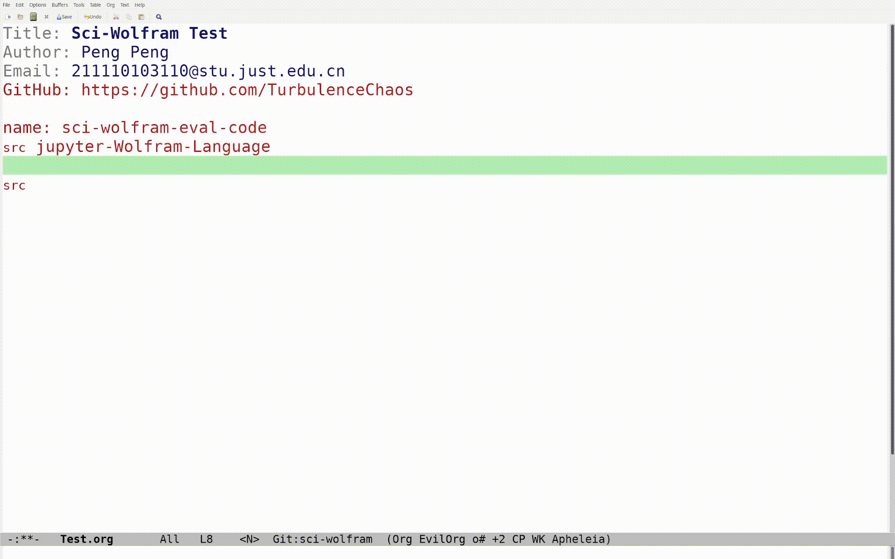

`sci-wolfram-format-region-or-buffer`

demo: [sci-wolfram-format-region-or-buffer-emacs-org-block.gif](https://github.com/TurbulenceChaos/sci-wolfram/blob/main/Images/gif/sci-wolfram-format-region-or-buffer-emacs-org-block.gif)

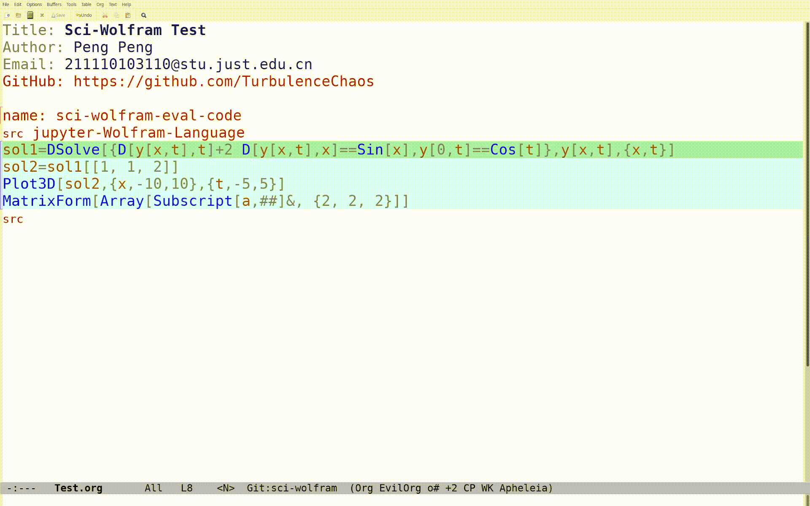

`sci-wolfram-convert-region-or-buffer-to-pdf-and-notebook`

demo: [sci-wolfram-convert-region-or-buffer-to-pdf-and-notebook-emacs-org-block.gif](https://github.com/TurbulenceChaos/sci-wolfram/blob/main/Images/gif/sci-wolfram-convert-region-or-buffer-to-pdf-and-notebook-emacs-org-block.gif)

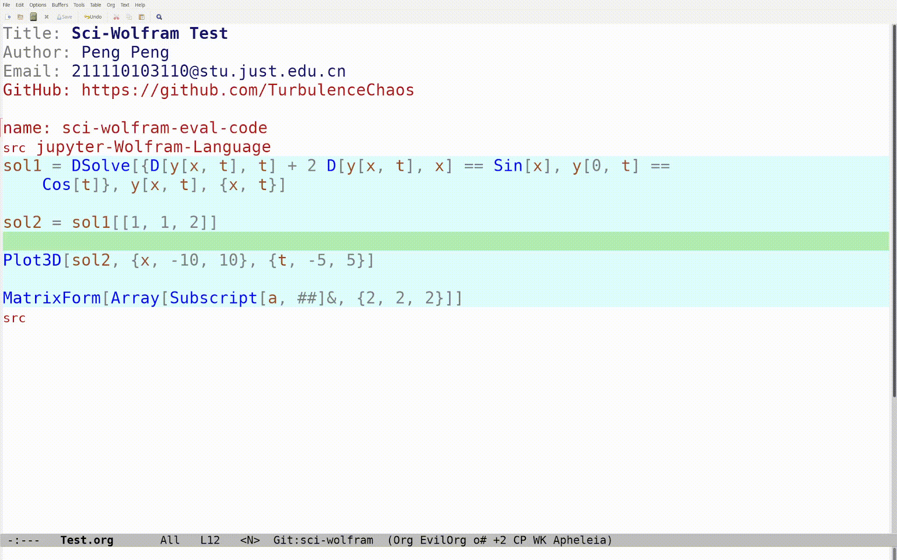

See [Test.org](Test/Test.org) for more details.

**For my emacs configuration, please check out: [sci-emacs](https://github.com/TurbulenceChaos/sci-emacs).**

# Installation for vscode
## Prerequisites
- **`wolframscript`** (free) and **`Wolfram Engine`** (free), or **`Mathematica`** (already include `wolframscript`)\
Required for executing wolfram scripts, which can be downloaded from https://www.wolfram.com/download-center/index.php.en 
- **`imgcat`**\
  Install using `pip install imgcat` to display images in vscode terminal.
- **`Wolfram Player`**\
Needed for viewing Mathematica notebook and `.cdf` files.\
Both `Wolfram Engine` and `Mathematica` already include `Wolfram Player`, so you don't need to install it manually.

## Configuration
- Enable **`Terminal > Integrated: Enable Images`** and **`Terminal > Integrated: GPU Acceleration`** in vscode settings, and make sure your system is using a discrete graphics card.


- Install the official [wolfram language extension](https://github.com/WolframResearch/vscode-wolfram) from vscode extension marketplace.


# Usage for vscode
## For repl
Modify the path of `sci-wolfram-image.wl` and paste it into repl.
```Mathematica
Get["/path/to/sci-wolfram-image.wl"];
```

Then choose regions in wolfram script file, and send them into repl for execution through `Terminal: Run Selected Text In Active Terminal` vscode command.
```Mathematica
sol1 = DSolve[{D[y[x, t], t] + 2 D[y[x, t], x] == Sin[x], y[0, t] == 
    Cos[t]}, y[x, t], {x, t}]

sol2 = sol1[[1, 1, 2]]

Plot3D[sol2, {x, -10, 10}, {t, -5, 5}]
```

demo: [sci-wolfram-vscode-repl.gif](https://github.com/TurbulenceChaos/sci-wolfram/blob/main/Images/gif/sci-wolfram-vscode-repl.gif)  

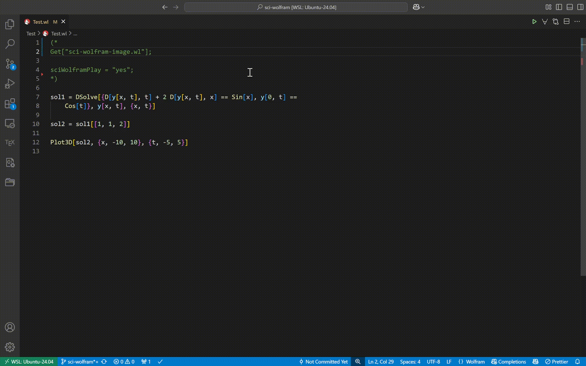

## For wolframscript command line
For `wolframscript -script file.wl` command, `$post` doesn't work, so you need to explicitly add `sciWolframDisplay` function to the code to display images.

```Mathematica
Get["/path/to/sci-wolfram-image.wl"];

sol1 = DSolve[{D[y[x, t], t] + 2 D[y[x, t], x] == Sin[x], y[0, t] == 
    Cos[t]}, y[x, t], {x, t}] // sciWolframDisplay

sol2 = sol1[[1, 1, 2]]

Plot3D[sol2, {x, -10, 10}, {t, -5, 5}] // sciWolframDisplay
```

Note: This process can be automatically done in emacs using `sci-wolfram.el` package. I haven't write vscode plugin to support it yet.

demo: [sci-wolfram-vscode-script-file.gif](https://github.com/TurbulenceChaos/sci-wolfram/blob/main/Images/gif/sci-wolfram-vscode-script-file.gif)  

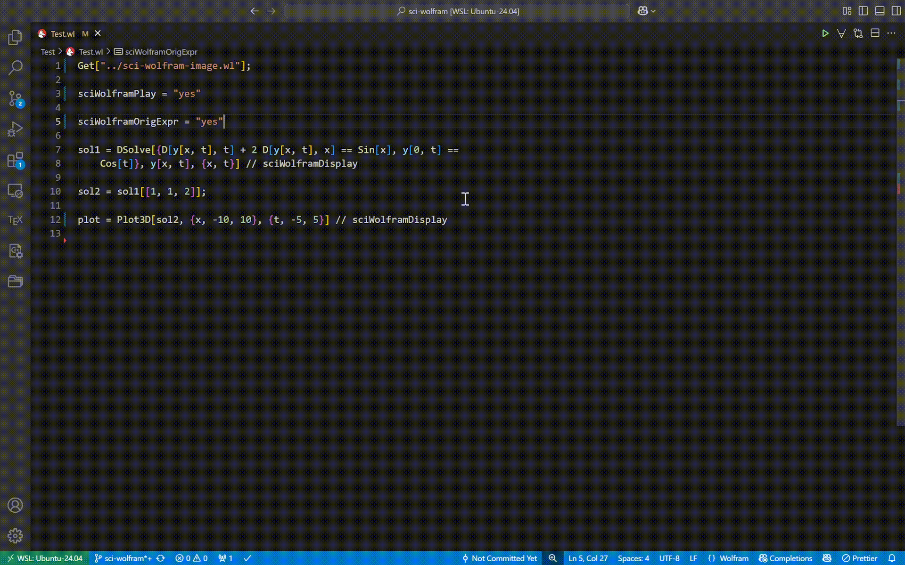

**Please see [Test.wl](Test/Test.wl) script for more details about configurable parameters of `sci-wolfram-image` package.**

## Convert wolfram script to pdf and notebook
You can add title, subtitle, section, text, etc., to convert wolfram script to pdf and Mathematica notebook using `TextCell` (can include formulas)

demo: [sci-wolfram-convert-to-pdf-and-notebook-vscode.gif](https://github.com/TurbulenceChaos/sci-wolfram/blob/main/Images/gif/sci-wolfram-convert-to-pdf-and-notebook-vscode.gif) 

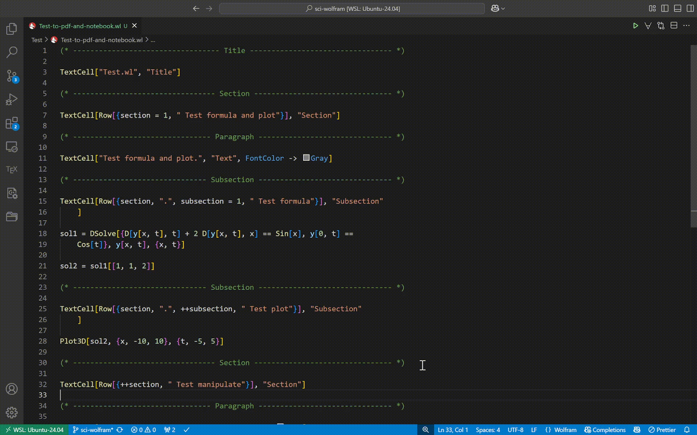

See [Test-to-pdf-and-notebook.wl](Test/Test-to-pdf-and-notebook.wl) for example.

See [sci-wolfram-pdf.wl](sci-wolfram-pdf.wl) for configurable parameters.

# Reference
for `sci-wolfram-image.wl`: 
- [Wolfram Community Discussion](https://community.wolfram.com/groups/-/m/t/2864001)
- [Mathematica Stack Exchange](https://mathematica.stackexchange.com/questions/258273/how-to-set-up-a-plot-viewer-for-wolfram-engine)

for `sci-wolfram-mode`:
- [xah-wolfram-mode](https://github.com/xahlee/xah-wolfram-mode)\
Note: `sci-wolfram-mode` was originally developed based on `xah-wolfram-mode`, with code heavily refactored and many features added.
- [wolfram-mode](https://github.com/kawabata/wolfram-mode)

for `eglot` `LSPServer`:
- [wolfram-language-mode](https://github.com/transentis/wolfram-language-mode)

for `sci-wolfram-pdf.wl`:
- [Mathematica Stack Exchange](https://mathematica.stackexchange.com/questions/293543/converting-wolfram-language-scripts-wls-into-pdfs)
- [Wolfram Community](https://community.wolfram.com/groups/-/m/t/37054)

