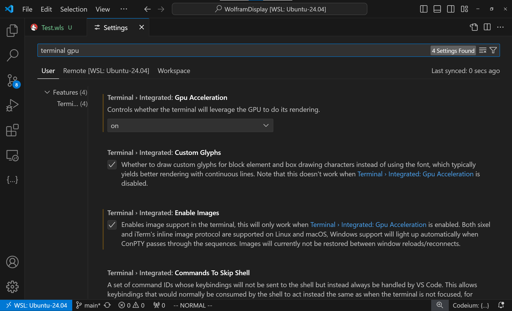
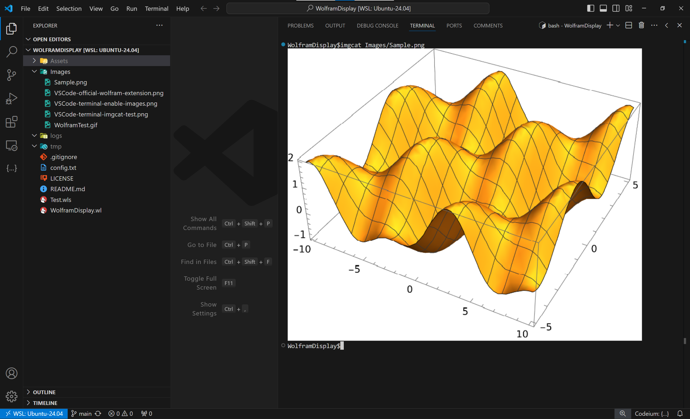
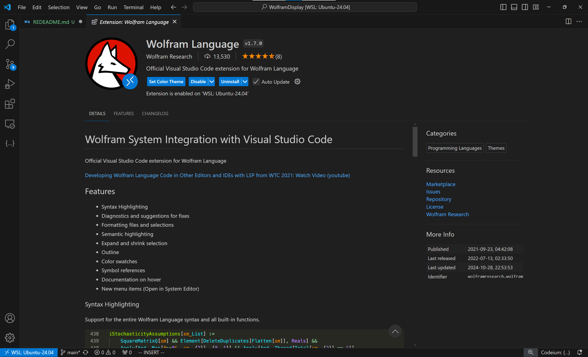

# Displaying Graphics Inline or Using WolframPlayer for Wolfram Engine

## Prerequisites

- `wolframscript`
- `wolframplayer`
- `imgcat` (install with `pip install imgcat`)
- `irfanview` (optional; you may choose other photo viewers that support animations)

## Getting Started

1. Clone this repository.
2. Edit the `config.txt` file. If you are using Windows Subsystem for Linux (WSL), here is an example configuration:
   | Variable      | Value                                                                                                                  |
   | ------------- | ---------------------------------------------------------------------------------------------------------------------- |
   | WolframPlayer | /mnt/c/Program Files/Wolfram Research/Wolfram Engine/14.1/WolframPlayer.exe (Set to `wolframplayer` on Linux systems.) |
   | ExternalPNG   | powershell.exe (Uses the default photo viewer, such as IrfanView, to open image files.)                                |
   | InlinePNG     | imgcat (displays images inline)                                                                                        |
   | ImgDPI        | 100 (Increase DPI for higher quality exported images, e.g., 300.)                                                      |

3. (**This method may work in the VS Code terminal with a discrete graphics card**)
   To show images inline using `imgcat`, use the VS Code terminal. 
   First, open the VS Code settings panel and enable `Terminal > Integrated: Enable Images` and `Terminal > Integrated: GPU Acceleration`. 

   

   Then, open the VS Code terminal and type `imgcat Images/Sample.png` to test if the image is displayed inline.

   

4. Install the official Wolfram Language extension in VS Code.

   

5. Run the `Test.wls` file.

   

