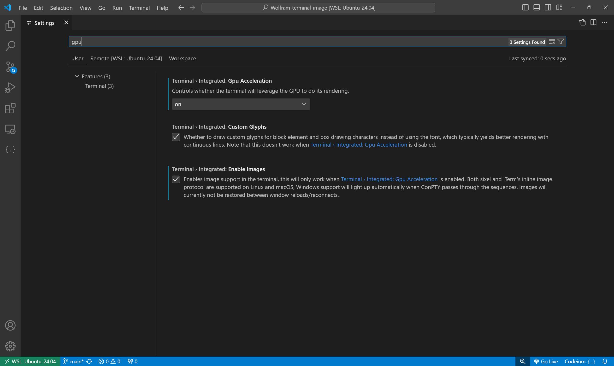
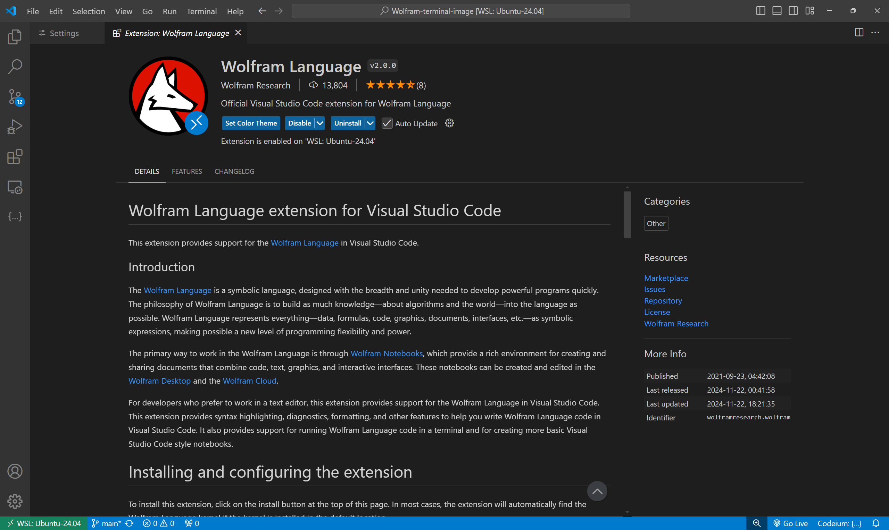
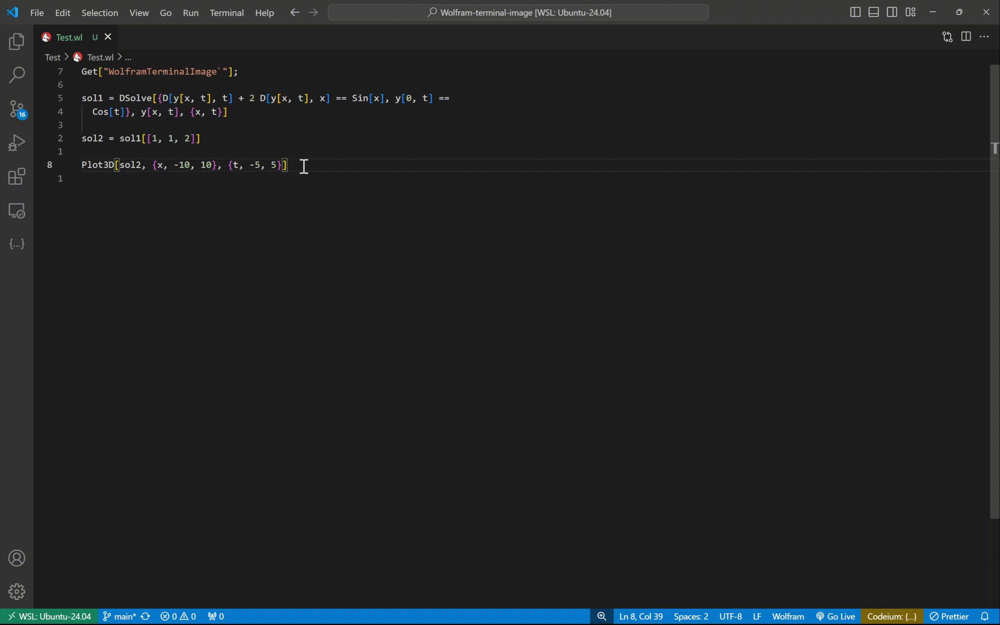

# Display WolframScript graphics in VS Code terminal

## Prerequisites

- `wolframscript`
- `imgcat` (install with `pip install imgcat`)

## Getting Started
1. Enable `Terminal > Integrated: Enable Images` and `Terminal > Integrated: GPU Acceleration` in VS Code. 
   
   

2. Install the official Wolfram Language extension.

   

3. Test the `Test.wl` script.

   

## Reference

1. [Wolfram Community](https://community.wolfram.com/groups/-/m/t/2864001)
2. [Mathematica Stack Exchange](https://mathematica.stackexchange.com/questions/258273/how-to-set-up-a-plot-viewer-for-wolfram-engine)