# sci-wolfram

Author: Peng Peng  \
Email: [211110103110@stu.just.edu.cn](mailto:211110103110@stu.just.edu.cn)  \
GitHub: [TurbulenceChaos/sci-wolfram](https://github.com/TurbulenceChaos/sci-wolfram)

# Table of contents
- [sci-wolfram](#sci-wolfram)
- [Table of contents](#table-of-contents)
- [Introduction](#introduction)
- [Features for Emacs](#features-for-emacs)
- [Features for VSCode](#features-for-vscode)
- [Installation for Emacs](#installation-for-emacs)
  - [Prerequisites](#prerequisites)
  - [Configuration](#configuration)
- [Usage for Emacs](#usage-for-emacs)
  - [For Wolfram Script File](#for-wolfram-script-file)
  - [For src-block in Org mode](#for-src-block-in-org-mode)
- [Installation for VSCode](#installation-for-vscode)
  - [Prerequisites](#prerequisites-1)
  - [Configuration](#configuration-1)
- [Usage for VSCode](#usage-for-vscode)
  - [For Repl](#for-repl)
  - [For Command Line](#for-command-line)
  - [Convert Wolfram Script to PDF and Mathematica Notebook](#convert-wolfram-script-to-pdf-and-mathematica-notebook)
- [Reference](#reference)

# Introduction
An all-in-one Wolfram Mathematica package for Emacs.

Display wolfram script images in Visual Studio Code Terminal.

# Features for Emacs
- [x] Automatic completion and formatting with `eglot` or `lsp-mode`
- [x] Prettify Mathematica symbols
- [x] Display wolfram script as images, LaTeX, and Wolfram Player interactive files
- [x] Convert wolfram script to PDF and Mathematica notebook

# Features for VSCode
- [x] Display wolfram script images in VSCode Terminal using `imgcat`
- [x] Convert wolfram script to PDF and Mathematica notebook

# Installation for Emacs
## Prerequisites
- `wolframscript` (free) and `Wolfram Engine` (free), or `Mathematica` (already include `wolframscript`)\
Required for running wolfram scripts, which can be downloaded from https://www.wolfram.com/download-center/index.php.en
- `Wolfram Player` (already included in `Wolfram Engine` and `Mathematica`)\
Needed for viewing Mathematica notebook and CDF interactive files.
- [Jupyter](https://jupyter.org/install) and [WolframLanguageForJupyter](https://github.com/WolframResearch/WolframLanguageForJupyter)
- [emacs-jupyter](https://github.com/emacs-jupyter/jupyter)
- [LaTeX](https://orgmode.org/manual/Previewing-LaTeX-fragments.html) (optional)\
In linux, you can install LaTeX with `sudo apt install texlive-full` to preview latex fragments in org-mode.

## Configuration
```lisp
(require 'package)
(add-to-list 'package-archives '("melpa" . "https://melpa.org/packages/"))
(package-initialize)
(when (not package-archive-contents)
  (package-refresh-contents))

;; emacs-jupyter
(unless (package-installed-p 'jupyter)
  (package-install 'jupyter))

;; org-mode
(setq org-babel-min-lines-for-block-output 100)

(org-babel-do-load-languages
 'org-babel-load-languages
 (append org-babel-load-languages
         '((jupyter . t))))

;; for emacs 29+, you can use `package-vc-install' to install packages from github
(unless (package-installed-p 'sci-wolfram)
  (package-vc-install "https://github.com/TurbulenceChaos/sci-wolfram"))

;; (add-hook 'sci-wolfram-mode-hook 'eglot-ensure) ; for eglot
;; (add-hook 'sci-wolfram-mode-hook 'lsp-deferred) ; or for lsp-mode

;; or you can manually download the package and add it to `load-path'
;; (add-to-list 'load-path "/path/to/sci-wolfram")
;; (require 'sci-wolfram)
;; (require 'sci-wolfram-jupyter)

;; to customize all configurable variables of `sci-wolfram' package,
;; just type M-x customize-group RET sci-wolfram-mode
```

Note: `(setq org-babel-min-lines-for-block-output 100)` is important for preventing truncation when the output of `Jupyter-Wolfram-Language` org-babel block spans many lines in org mode. The default value is 10.

For [Doom Emacs](https://github.com/doomemacs/doomemacs) users (see [this discussion](https://github.com/TurbulenceChaos/sci-wolfram/issues/4)):

```lisp
;; packages.el
(package! sci-wolfram
  :recipe (:host github
           :repo "TurbulenceChaos/sci-wolfram"
           :files ("*.el" "*.wl" "Data-example")))
```

```lisp
;; config.el
(use-package! sci-wolfram
  :defer t
  :config
  (unless (executable-find "wolframscript")
    (message "sci-wolfram: wolframscript not found on PATH"))
  ;; (add-hook 'sci-wolfram-mode-hook 'eglot-ensure) ; for eglot
  ;; (add-hook 'sci-wolfram-mode-hook 'lsp-deferred) ; or for lsp-mode
  )

;; to customize all configurable variables of `sci-wolfram' package,
;; just type M-x customize-group RET sci-wolfram-mode
```

# Usage for Emacs

The default leader key of `sci-wolfram-mode` is `F6`.

## For Wolfram Script File
`eglot` or `lsp-mode` (support auto-completion and format)

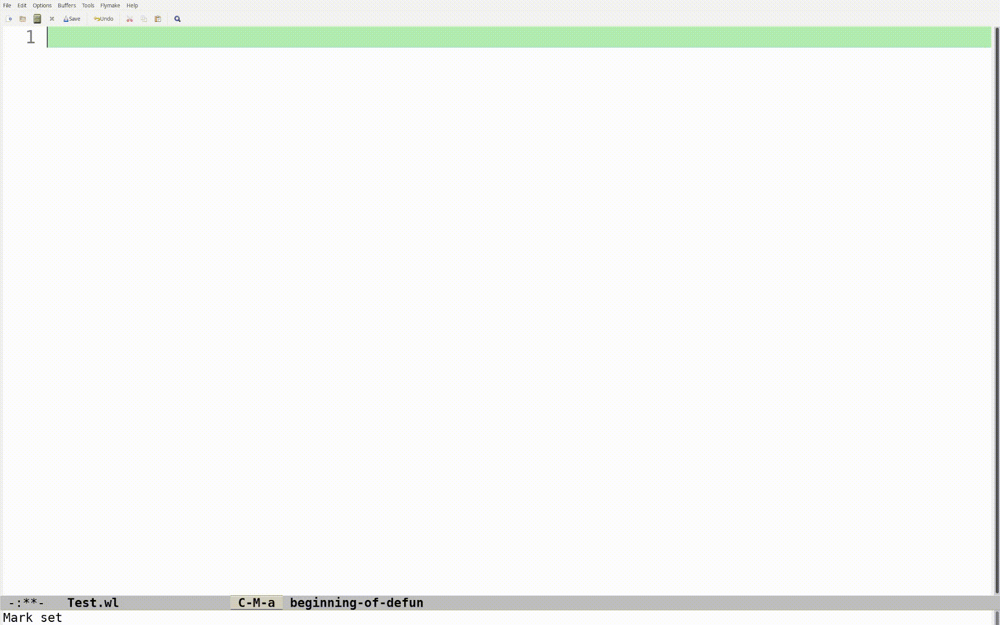

`sci-wolfram-prettify-symbols` (toggle with M-x `prettify-symbols-mode`)

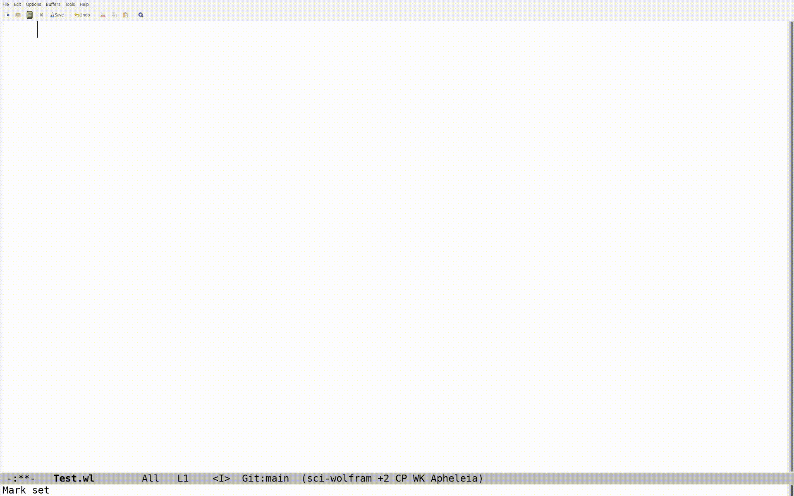

`sci-wolfram-doc-lookup`


`sci-wolfram-jupyter-eval-region-or-buffer` 

Display images, latex fragments, and Wolfram Player interactive files.
Very Fast and support org src-block session.

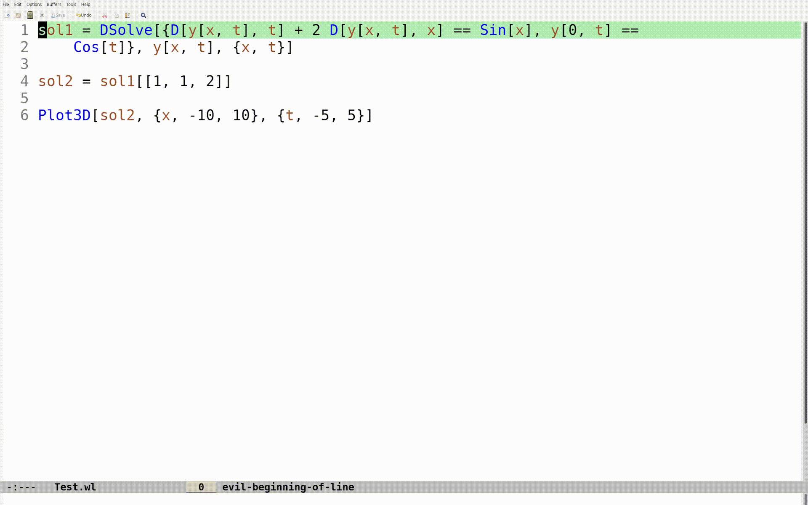

`sci-wolfram-eval-region-or-buffer`

Use wolframscript to execute code. Slower than jupyter and do not support session.

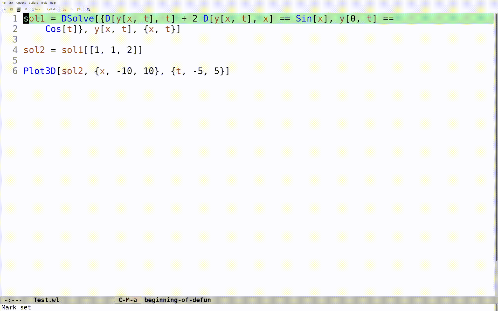

`sci-wolfram-convert-region-or-buffer-to-pdf-and-notebook`

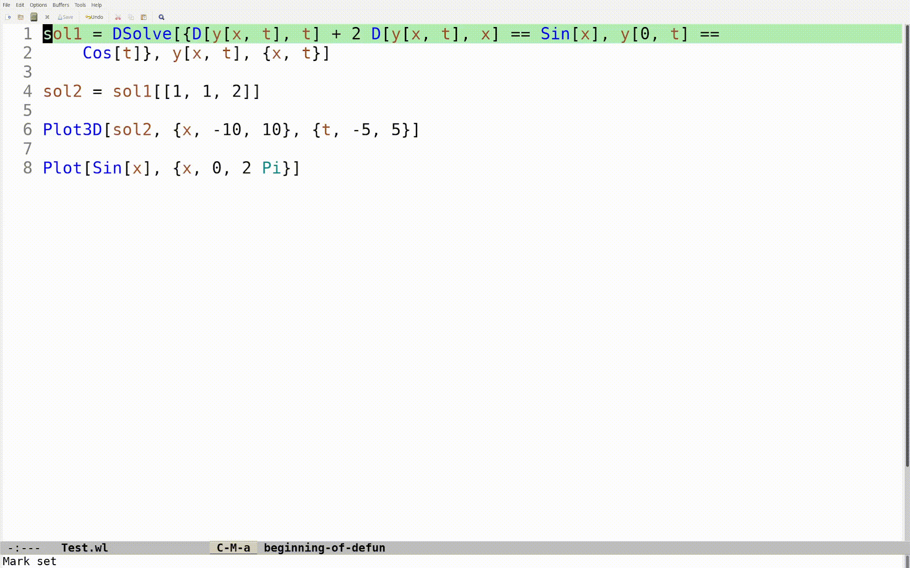

A more complex case to add title, section, text, formula, etc. using `TextCell`:

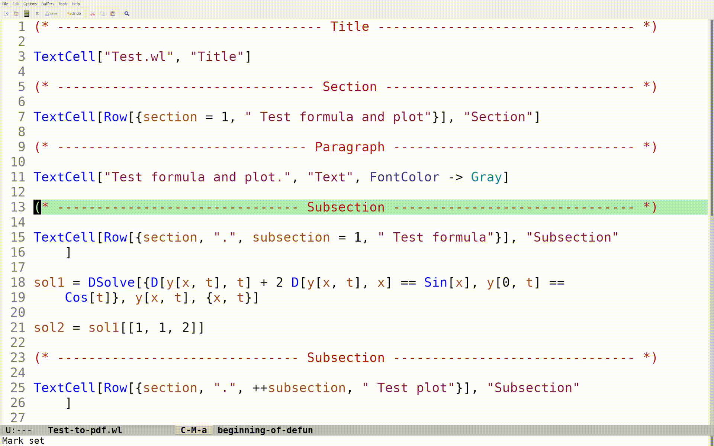

## For src-block in Org mode

See [Test.org](Test/Test.org) for more details.

`org-babel-execute-code`

For emacs org-mode, formulas can be converted into LaTeX fragments, making it easy to paste them into Microsoft Word or LaTeX documents.


`completion-at-point`

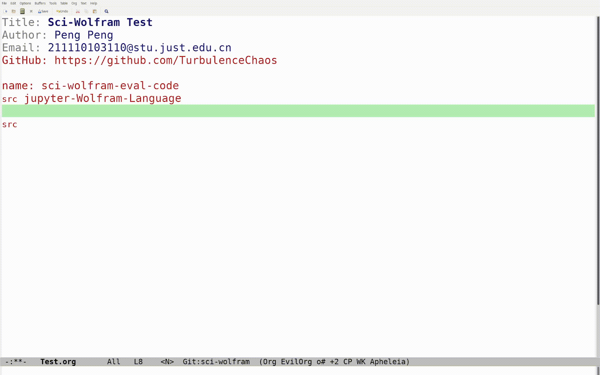

`sci-wolfram-format-region-or-buffer`

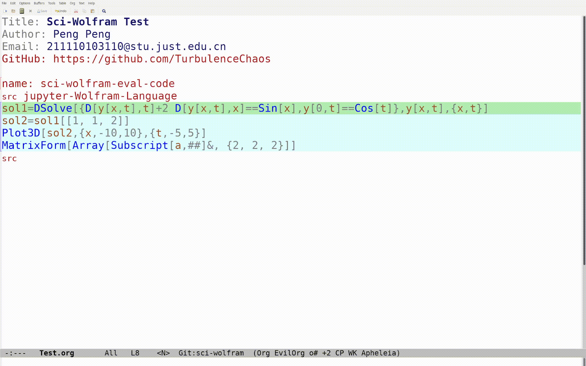

`sci-wolfram-convert-region-or-buffer-to-pdf-and-notebook`

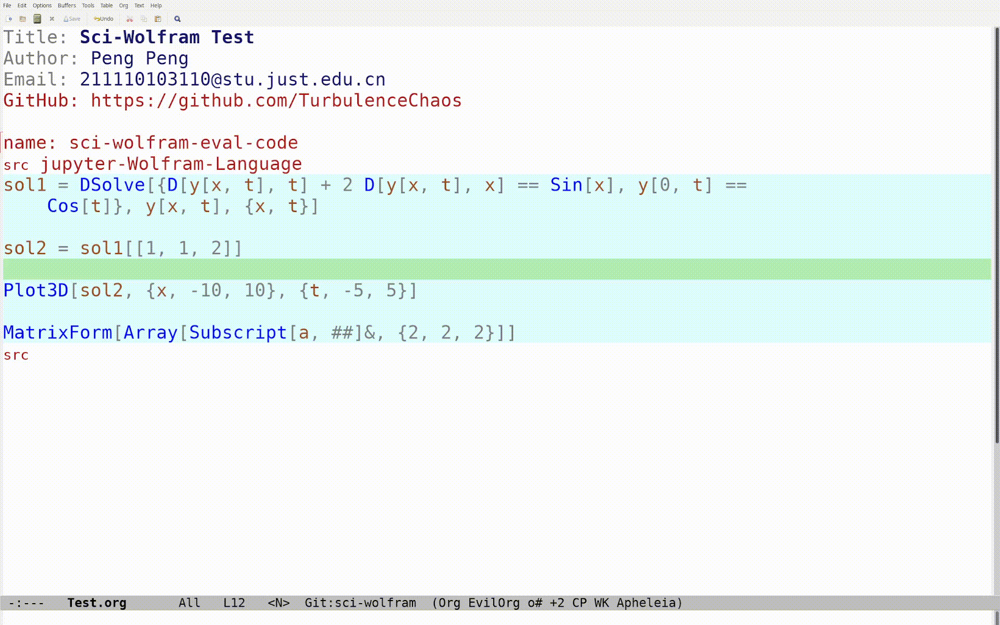

> [!IMPORTANT]
> Wolfram `Print[code]` function may truncate string lines in repl or jupyter. Consider using `WriteString` instead:
> ```Mathematica
> WriteString["std", code, "\n"];
> ```

# Installation for VSCode
## Prerequisites

- `wolframscript` (free) and `Wolfram Engine` (free), or `Mathematica` (already include `wolframscript`)\
Required for running wolfram scripts, which can be downloaded from https://www.wolfram.com/download-center/index.php.en
- `Wolfram Player` (already included in `Wolfram Engine` and `Mathematica`)\
Needed for viewing Mathematica notebook and CDF interactive files.
- `imgcat`\
  Install with `pip install imgcat` to display images in vscode terminal.

## Configuration

- Enable `Terminal > Integrated: Enable Images` and `Terminal > Integrated: GPU Acceleration` in vscode settings, and make sure your system is using a discrete graphics card!


- Install the official [wolfram language extension](https://github.com/WolframResearch/vscode-wolfram) from vscode extension marketplace.


# Usage for VSCode
## For Repl

Steps:

1. `Ctrl+Shift+P`: Wolfram Language: Start Wolfram in Terminal
2. Modify the path `Get["/path/to/sci-wolfram-image.wl"];` and paste it into repl
3. Select codes in wolfram script file and send them into repl by `Terminal: Run Selected Text In Active Terminal`

See [Test.wl](Test/Test.wl) for more details about configurable parameters of `sci-wolfram-image` package.

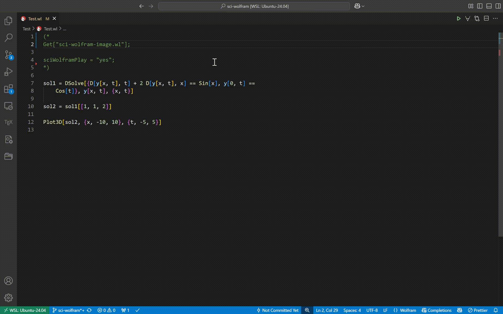

## For Command Line
For `wolframscript -script file.wl` command line, `$Post` doesn't work. You need to explicitly add `sciWolframDisplay` function to display images.

```Mathematica
Get["/path/to/sci-wolfram-image.wl"];

sol1 = DSolve[{D[y[x, t], t] + 2 D[y[x, t], x] == Sin[x], y[0, t] == 
    Cos[t]}, y[x, t], {x, t}] // sciWolframDisplay

sol2 = sol1[[1, 1, 2]]

Plot3D[sol2, {x, -10, 10}, {t, -5, 5}] // sciWolframDisplay
```

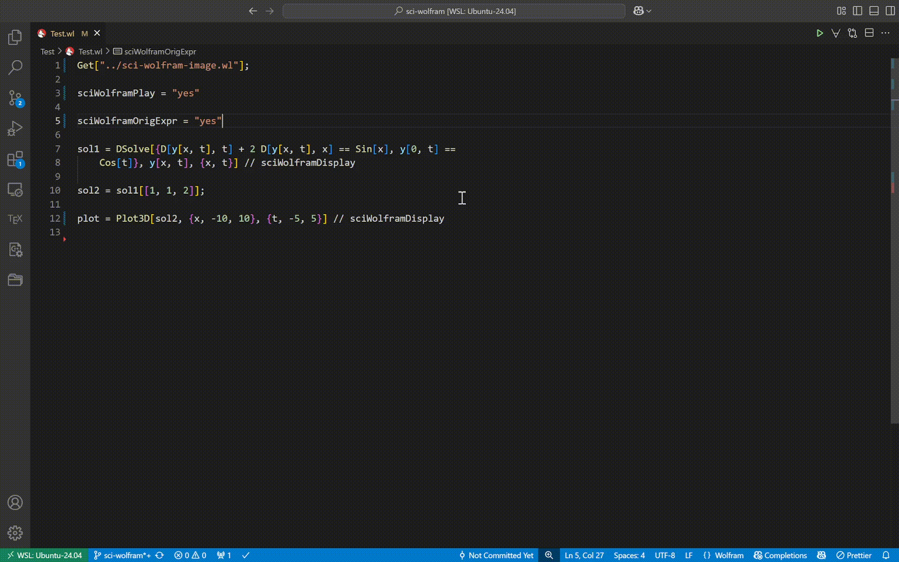

## Convert Wolfram Script to PDF and Mathematica Notebook
You can add title, subtitle, section, text, formula, etc. using `TextCell`.

```shell
wolframscript -script /path/to/sci-wolfram-pdf.wl /path/to/file.wl
```

See [Test-to-pdf-and-notebook.wl](Test/Test-to-pdf-and-notebook.wl) for example.

See [sci-wolfram-pdf.wl](sci-wolfram-pdf.wl) for configurable parameters.

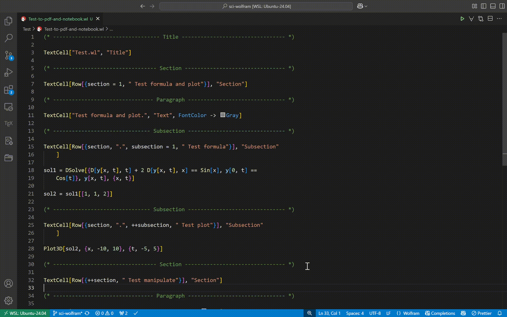

# Reference
for `sci-wolfram-image.wl`: 
- [Wolfram Community Discussion](https://community.wolfram.com/groups/-/m/t/2864001)
- [Mathematica Stack Exchange](https://mathematica.stackexchange.com/questions/258273/how-to-set-up-a-plot-viewer-for-wolfram-engine)

for `sci-wolfram-mode`:
- [xah-wolfram-mode](https://github.com/xahlee/xah-wolfram-mode)\
`sci-wolfram-mode` was originally developed based on `xah-wolfram-mode`, with code heavily refactored and many new features added.
- [wolfram-mode](https://github.com/kawabata/wolfram-mode)

for `eglot` `LSPServer`:
- [wolfram-language-mode](https://github.com/transentis/wolfram-language-mode)

for `sci-wolfram-pdf.wl`:
- [Mathematica Stack Exchange](https://mathematica.stackexchange.com/questions/293543/converting-wolfram-language-scripts-wls-into-pdfs)
- [Wolfram Community](https://community.wolfram.com/groups/-/m/t/37054)

