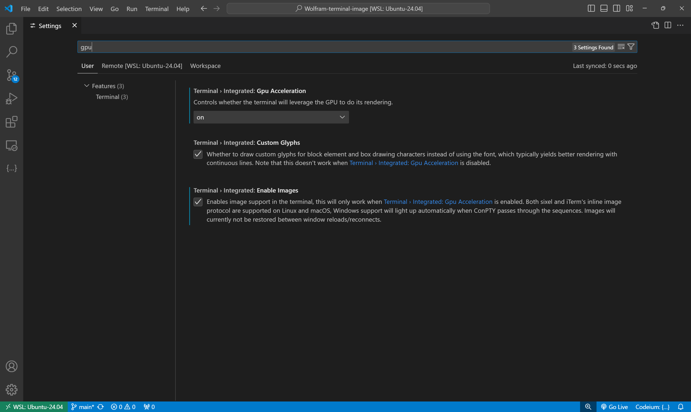
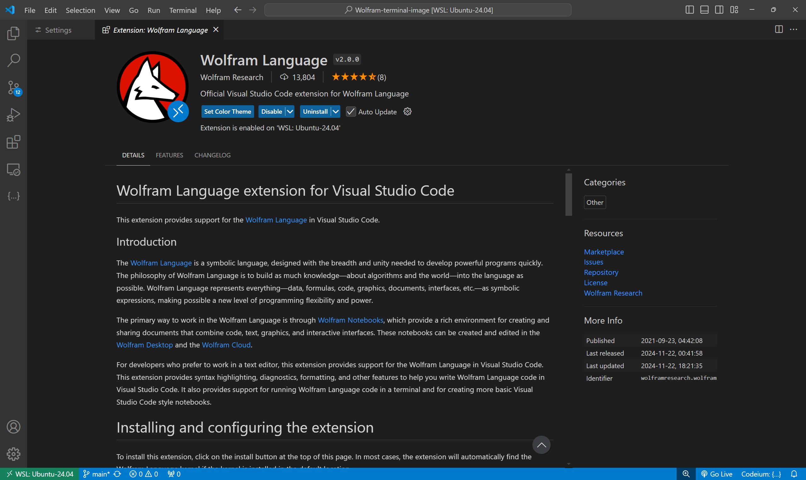

# sci-wolfram
Author: Peng Peng

Email: [211110103110@stu.just.edu.cn](mailto:211110103110@stu.just.edu.cn)

GitHub: [TurbulenceChaos/sci-wolfram](https://github.com/TurbulenceChaos/sci-wolfram)

# Table of Contents
<!-- markdown-toc start - Don't edit this section. Run M-x markdown-toc-refresh-toc -->
- [Introduction](#introduction)
- [Features for Emacs](#features-for-emacs)
- [Features for VSCode](#features-for-vscode)
- [Installation for Emacs](#installation-for-emacs)
  - [Prerequisites](#prerequisites)
  - [Configuration](#configuration)
- [Usage for Emacs](#usage-for-emacs)
  - [For Wolfram Script File](#for-wolfram-script-file)
  - [For Wolfram Src-block in Org-mode](#for-wolfram-src-block-in-org-mode)
- [Installation for VSCode](#installation-for-vscode)
  - [Prerequisites](#prerequisites-1)
  - [Configuration](#configuration-1)
- [Usage for VSCode](#usage-for-vscode)
  - [For Wolfram REPL](#for-wolfram-repl)
  - [Convert Wolfram Script to PDF and Mathematica Notebook](#convert-wolfram-script-to-pdf-and-mathematica-notebook)
- [Change Log](#change-log)
  - [v3.0.0](#v300)
- [Reference](#reference)

<!-- markdown-toc end -->

# Introduction
An all-in-one Wolfram Mathematica package for Emacs.

Display wolfram script images in Visual Studio Code Terminal.

# Features for Emacs
- [x] **Display wolfram script as images, LaTeX, and Wolfram Player interactive files**
- [x] **Support async Wolfram REPL session calc**
- [x] Automatic completion and formatting with LSPServer
- [x] Convert wolfram script to PDF and Mathematica notebook
- [x] Prettify Mathematica symbols

# Features for VSCode
- [x] **Display wolfram script images in VSCode Terminal using imgcat**
- [x] Convert wolfram script to PDF and Mathematica notebook

# Installation for Emacs
## Prerequisites
- **Wolfram Engine** (**free**, already include **wolframscript** and **Wolfram Player**), or **Mathematica**\
Required for running wolfram scripts, which can be downloaded from https://www.wolfram.com/download-center/index.php.en
- [LaTeX](https://orgmode.org/manual/Previewing-LaTeX-fragments.html) (optional)\
Preview latex formula in emacs org-mode:
  - Linux: `sudo apt install texlive-full`
  - Windows: install [MiKTeX](https://miktex.org/howto/install-miktex)

## Configuration
```lisp
;; For emacs 29+, you can use `package-vc-install' to install packages from github
(unless (package-installed-p 'sci-wolfram)
  (package-vc-install "https://github.com/TurbulenceChaos/sci-wolfram"))

;; (add-hook 'sci-wolfram-mode-hook 'eglot-ensure) ; eglot
;; (add-hook 'sci-wolfram-mode-hook 'lsp-deferred) ; or lsp-mode

;; or you can manually download the package and add it to `load-path'
;; (add-to-list 'load-path "/path/to/sci-wolfram")
;; (require 'sci-wolfram)

;; to customize all configurable variables of `sci-wolfram' package,
;; just type M-x customize-group RET sci-wolfram-mode RET
```

For [Doom Emacs](https://github.com/doomemacs/doomemacs) users (see [this discussion](https://github.com/TurbulenceChaos/sci-wolfram/issues/4)):

```elisp
;; doom/packages.el
(package! sci-wolfram
  :recipe (:host github
           :repo "TurbulenceChaos/sci-wolfram"
           :files ("*.el" "*.wl")))
```

```elisp
;; doom/config.el
(use-package! sci-wolfram
  :defer t
  :config
  ;; (add-hook 'sci-wolfram-mode-hook 'eglot-ensure) ; eglot
  ;; (add-hook 'sci-wolfram-mode-hook 'lsp-deferred) ; or lsp-mode
  )

;; to customize all configurable variables of `sci-wolfram' package,
;; just type M-x customize-group RET sci-wolfram-mode RET
```

# Usage for Emacs
Default leader key in sci-wolfram-mode is `Ctrl-c`, or you can just type `M-x sci-wolfram-` to use all interactive functions.

## For Wolfram Script File
`sci-wolfram-run-region-or-buffer`

Display images, latex fragments, and Wolfram Player interactive files.

**Support async Wolfram REPL session calc.**

https://github.com/user-attachments/assets/ce9bd35c-2226-4060-9d21-d16a909705e9

`eglot` or `lsp-mode`

Support auto-completion and formatting.

https://github.com/user-attachments/assets/dd92aec6-ac95-48c4-81a3-dfebaa373410

`sci-wolfram-convert-to-notebook`

Convert region or buffer code to PDF and Mathematica notebook.

You can using `TextCell` to add title, subtitle, section, text, formula, etc to Mathematica notebook.

https://github.com/user-attachments/assets/e1cc634e-df51-4e83-86be-397e95eb9588

`sci-wolfram-prettify-symbols`

Toggle with `M-x prettify-symbols-mode`

https://github.com/user-attachments/assets/e3280367-7d27-4987-842f-3df41b1535e0

`sci-wolfram-doc-lookup`

Search wolfram doc in web.

https://github.com/user-attachments/assets/3d2d058b-d847-43f0-a774-1a526992aadd

> [!NOTE]
> For **any selected region in any buffer**, you can evaluate it, format it, or convert it to a Mathematica notebook.\
> For example, you can run Wolfram code in a LaTeX file and insert the generated LaTeX fragments back into the document.
> 
> Wolfram expressions are converted to Mathematica notebook images by default. To convert them to LaTeX fragments instead, run `M-x customize-group RET sci-wolfram-mode RET` and set `sci-wolfram-formula-type` to latex.

https://github.com/user-attachments/assets/1d226657-a3a3-4145-95df-f2a5b7348ecd

## For Wolfram Src-block in Org-mode

`org-babel-execute:wolfram`

Display images, latex fragments, and Wolfram Player interactive files.

**Support async session src-block calc.**

https://github.com/user-attachments/assets/c28920eb-3ed5-4f4d-86f3-c13bc0733e14

`completion-at-point`

Support auto-completion inside wolfram src-block.

https://github.com/user-attachments/assets/44f5aa76-fed0-413f-b71e-b199f4fd04d7

`sci-wolfram-format-region-or-buffer`

Format region or wolfram src-block code.

https://github.com/user-attachments/assets/de4a3d06-751e-41fb-8602-0a3a844ac9e9

`sci-wolfram-convert-to-notebook`

Convert region or wolfram src-block code to PDF and Mathematica notebook.

You can using `TextCell` to add title, subtitle, section, text, formula, etc to Mathematica notebook.

https://github.com/user-attachments/assets/24f62587-6291-4030-be8f-63050b6913d3

> [!IMPORTANT]
> 1. `Print[code]` will truncate string lines in Wolfram REPL. Consider using `WriteString["stdout", code, "\n"]` instead.
> 2. For org-mode version < 9.8, spaces before a string (i.e. `str="    Hello"`) in src-block session async running will be automatically removed.
> From org version 9.8, `org-babel-comint-async-register` function introduced a new option `disable-prompt-filtering` to avoid this situation.
>
> **Please read [Test.org](Test/Test.org) for more details.**

# Installation for VSCode
## Prerequisites

- **Wolfram Engine** (**free**, already include **wolframscript** and **Wolfram Player**), or **Mathematica**\
Required for running wolfram scripts, which can be downloaded from https://www.wolfram.com/download-center/index.php.en
- [imgcat](https://github.com/wookayin/python-imgcat)\
Enable image display in VSCode Terminal.\
Install with `pip install imgcat`

## Configuration

- Enable `Terminal > Integrated: Enable Images` and `Terminal > Integrated: GPU Acceleration` in VSCode settings, and **make sure your system is using a discrete graphics card!**



- Install the official [wolfram language extension](https://github.com/WolframResearch/vscode-wolfram) from vscode extension marketplace.



# Usage for VSCode
## For Wolfram REPL
Steps:
1. `Ctrl+Shift+p: Wolfram Language: Start Wolfram in Terminal`
2. Modify and paste below code into REPL:
```wolfram
Get["/path/to/sciWolframDisplayImage.wl"];

$Post = sciWolframDisplayImage[#] &;
```
3. Select codes in wolfram script file and send them into REPL by `Ctrl+Shift+p: Terminal: Run Selected Text In Active Terminal`

Read [TestDisplayImages.wl](Test/TestDisplayImages.wl) for more details about configurable parameters of `sciWolframDisplayImage` package.

https://github.com/user-attachments/assets/29e36751-2810-4542-a575-bd29eae8b19d

## Convert Wolfram Script to PDF and Mathematica Notebook
You can using `TextCell` to add title, subtitle, section, text, formula, etc to Mathematica notebook.

Steps:
1. `Ctrl+Shift+p: Wolfram Language: Start Wolfram in Terminal`
2. Modify and paste below code into REPL:
```wolfram
Get["/path/to/sciWolframConvertToNotebook.wl"];

sciWolframConvertToNotebook["/path/to/file.wl"];
```
Read [TestConvertToNotebook.wl](Test/TestConvertToNotebook.wl) and [file.wl](Test/file.wl) for more details.

https://github.com/user-attachments/assets/97fa292f-e74c-4c63-9098-aaddeb05b55a

# Change Log
## v3.0.0
- **Add Wolfram REPL async session calc support**
- **Remove emacs-jupyter package dependency**
- Refactor `sciWolframDisplayImage.wl` and `sciWolframConvertToNotebook.wl` package

# Reference
For `sciWolframDisplayImage.wl`:\
Thanks to the following two discussions for guidance on displaying wolfram images and Mathematica interactive files:
- [Displaying graphics and images inline on Wolfram Engine from Wolfram Community Discussion](https://community.wolfram.com/groups/-/m/t/2864001)
- [How to set up a Plot viewer for Wolfram Engine from Mathematica Stack Exchange](https://mathematica.stackexchange.com/questions/258273/how-to-set-up-a-plot-viewer-for-wolfram-engine)

For `sci-wolfram-mode`:\
Thanks to xah-wolfram-mode by Xah Lee, wolfram-mode by Kawabata, and wolfram-mode by Daniel Nicolai for their inspiration and valuable references.
- [xah-wolfram-mode](https://github.com/xahlee/xah-wolfram-mode)
- [wolfram-mode](https://github.com/kawabata/wolfram-mode)
- [wolfram-mode](https://github.com/dalanicolai/wolfram-mode/tree/master)

For `LSPServer`:\
Thanks to wolfram-language-mode by Oliver Grasl and vscode-wolfram by Wolfram Research for valuable references on LSPServer:
- [wolfram-language-mode](https://github.com/transentis/wolfram-language-mode)
- [vscode-wolfram](https://github.com/WolframResearch/vscode-wolfram)

For `sciWolframConvertToNotebook.wl`:\
Thanks to the following two discussions for guidance on converting wolfram scripts to PDF files:
- [Converting Wolfram Language Scripts into PDFs from Mathematica Stack Exchange](https://mathematica.stackexchange.com/questions/293543/converting-wolfram-language-scripts-wls-into-pdfs)
- [How to get Defer to behave with Manipulate/Dynamic from Wolfram Community](https://community.wolfram.com/groups/-/m/t/37054)

