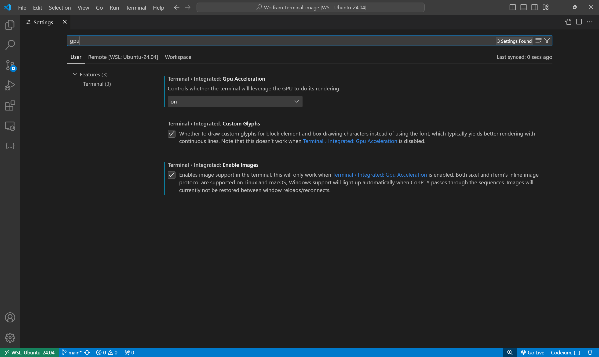
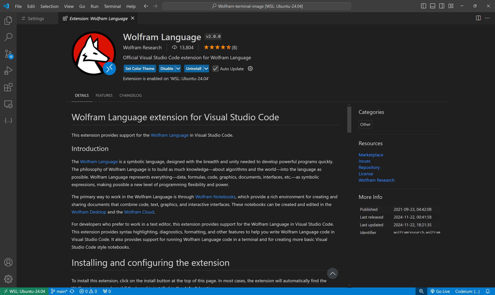

# sci-wolfram
Author: PENG

Email: [p.peng01@outlook.com](mailto:p.peng01@outlook.com)

GitHub: [TurbulenceChaos/sci-wolfram](https://github.com/TurbulenceChaos/sci-wolfram)

# Table of Contents
<!-- markdown-ts-toc: -->
<!-- NOTE: markdown-ts-toc generated text section may be overwritten. -->
- [Introduction](#introduction)
- [Features for Emacs](#features-for-emacs)
- [Features for VSCode](#features-for-vscode)
- [Installation for Emacs](#installation-for-emacs)
  - [Prerequisites](#prerequisites)
  - [Configuration](#configuration)
- [Usage for Emacs](#usage-for-emacs)
  - [For Wolfram Script File](#for-wolfram-script-file)
  - [For Wolfram Src-block in Org-mode](#for-wolfram-src-block-in-org-mode)
- [Installation for VSCode](#installation-for-vscode)
  - [Prerequisites](#prerequisites-1)
  - [Configuration](#configuration-1)
- [Usage for VSCode](#usage-for-vscode)
  - [For Wolfram REPL](#for-wolfram-repl)
  - [Convert Wolfram Script to PDF and Mathematica Notebook](#convert-wolfram-script-to-pdf-and-mathematica-notebook)
- [Change Log](#change-log)
  - [v3.0.0](#v300)
- [Reference](#reference)
<!-- markdown-ts-toc-end: -->

# Introduction
An all-in-one Wolfram Mathematica package for [Emacs](https://www.gnu.org/software/emacs/emacs.html).

Display wolfram script images in [Visual Studio Code](https://code.visualstudio.com/) Terminal.

# Features for Emacs
- [x] Display wolfram script as **images**, **LaTeX**, and Wolfram Player **interactive** files
- [x] Support Wolfram REPL **async session** calc
- [x] Automatic completion and formatting with LSPServer
- [x] Convert wolfram script to PDF and Mathematica notebook
- [x] Prettify Mathematica symbols

# Features for VSCode
- [x] Display wolfram script images in VSCode Terminal using **imgcat**
- [x] Convert wolfram script to PDF and Mathematica notebook

# Installation for Emacs
## Prerequisites
- [Wolfram Engine](https://www.wolfram.com/engine/) (**FREE**, includes `wolframscript` and `wolframplayer`) or [Wolfram Mathematica](https://www.wolfram.com/mathematica/)
- [LaTeX](https://www.tug.org/texlive/) (optional)

## Configuration
```lisp
;; For emacs 29+, you can use `package-vc-install' to install packages from github
(unless (package-installed-p 'sci-wolfram)
  (package-vc-install "https://github.com/TurbulenceChaos/sci-wolfram"))

;; (add-hook 'sci-wolfram-mode-hook #'eglot-ensure) ; eglot
;; (add-hook 'sci-wolfram-mode-hook #'lsp-deferred) ; or lsp-mode

;; or you can manually download the package and add it to `load-path'
;; (add-to-list 'load-path "/path/to/sci-wolfram")
;; (require 'sci-wolfram)

;; to customize all configurable variables of `sci-wolfram' package,
;; just type M-x customize-group RET sci-wolfram RET
```

For [Doom Emacs](https://github.com/doomemacs/doomemacs) users (see [this discussion](https://github.com/TurbulenceChaos/sci-wolfram/issues/4)):

```elisp
;; doom/packages.el
(package! sci-wolfram
  :recipe (:host github
           :repo "TurbulenceChaos/sci-wolfram"
           :files ("*.el" "*.wl" "LSPSymbols")))
```

```elisp
;; doom/config.el
(use-package! sci-wolfram
  :defer t
  :config
  ;; (add-hook 'sci-wolfram-mode-hook #'eglot-ensure) ; eglot
  ;; (add-hook 'sci-wolfram-mode-hook #'lsp-deferred) ; or lsp-mode
  )

;; to customize all configurable variables of `sci-wolfram' package,
;; just type M-x customize-group RET sci-wolfram RET
```

# Usage for Emacs
Type `Ctrl-c` in sci-wolfram-mode or `M-x sci-wolfram-` to use all interactive functions.

## For Wolfram Script File
`M-x sci-wolfram-run-region-or-buffer`

Display **images**, **LaTeX** fragments, and Wolfram Player **interactive** files.

Support Wolfram REPL **async session** calc.

https://github.com/user-attachments/assets/ce9bd35c-2226-4060-9d21-d16a909705e9

`M-x eglot` or `M-x lsp`

Support auto-completion and formatting.

https://github.com/user-attachments/assets/dd92aec6-ac95-48c4-81a3-dfebaa373410

`M-x sci-wolfram-convert-to-notebook`

Convert Wolfram script to Wolfram Mathematica notebook.

You can using `TextCell` to add title, section, text, formula, etc.

https://github.com/user-attachments/assets/e1cc634e-df51-4e83-86be-397e95eb9588

`M-x prettify-symbols-mode`

https://github.com/user-attachments/assets/e3280367-7d27-4987-842f-3df41b1535e0

`M-x sci-wolfram-doc-lookup`

Search Wolfram doc in web.

https://github.com/user-attachments/assets/3d2d058b-d847-43f0-a774-1a526992aadd

Display formula as LaTeX fragments:

https://github.com/user-attachments/assets/1d226657-a3a3-4145-95df-f2a5b7348ecd

## For Wolfram Src-block in Org-mode
`org-babel-execute:wolfram`

Display **images**, **LaTeX** fragments, and Wolfram Player **interactive** files.

Support **async session** src-block calc.

https://github.com/user-attachments/assets/c28920eb-3ed5-4f4d-86f3-c13bc0733e14

`completion-at-point`

Support **auto-completion** inside Wolfram src-block.

https://github.com/user-attachments/assets/44f5aa76-fed0-413f-b71e-b199f4fd04d7

`M-x sci-wolfram-format-region-or-buffer`

Format Wolfram src-block code.

https://github.com/user-attachments/assets/de4a3d06-751e-41fb-8602-0a3a844ac9e9

Read [emacs-test-org-mode.org](Test/emacs-test-org-mode.org) for more details.

# Installation for VSCode
## Prerequisites
- [Wolfram Engine](https://www.wolfram.com/engine/) (**FREE**, includes `wolframscript` and `wolframplayer`) or [Wolfram Mathematica](https://www.wolfram.com/mathematica/)
- [imgcat](https://github.com/wookayin/python-imgcat) (display image in vscode terminal)

## Configuration
- Enable `Terminal > Integrated: Enable Images` and `Terminal > Integrated: GPU Acceleration` in VSCode settings,
and make sure your system is using a **discrete graphics card**!



- Install the official [wolfram language extension](https://github.com/WolframResearch/vscode-wolfram).



# Usage for VSCode
## For Wolfram REPL
Steps:
1. `Ctrl+Shift+p: Wolfram Language: Start Wolfram in Terminal`
2. Modify and paste below code into REPL:
```wolfram
Get["/path/to/DisplayImage.wl"];
$Post = DisplayImage[#] &;
```
3. `Ctrl+Shift+p: Terminal: Run Selected Text In Active Terminal`

Read [vscode-test-display-image.wl](Test/vscode-test-display-image.wl) for more details.

https://github.com/user-attachments/assets/29e36751-2810-4542-a575-bd29eae8b19d

## Convert Wolfram Script to PDF and Mathematica Notebook
Steps:
1. `Ctrl+Shift+p: Wolfram Language: Start Wolfram in Terminal`
2. Modify and paste below code into REPL:
```wolfram
Get["/path/to/ConvertToNotebook.wl"];
ConvertToNotebook["/path/to/file.wl"];
```
Read [vscode-test-convert-to-notebook.wl](Test/vscode-test-convert-to-notebook.wl) for more details.

https://github.com/user-attachments/assets/97fa292f-e74c-4c63-9098-aaddeb05b55a

# Change Log
## v3.2.8
- Simplify code
- Fix % or Out[] NULL error
- Add syntax check

## v3.0.0
- Add Wolfram REPL **async session** calc support
- **Remove** [emacs-jupyter](https://github.com/emacs-jupyter/jupyter) package dependency
- Refactor `sciWolframDisplayImage.wl` and `sciWolframConvertToNotebook.wl` package

# Reference
For `sciWolframDisplayImage.wl`:

The core idea is to use `$Post` function in Wolfram to automatically convert complex expression or dynamic plot to **images**, **LaTeX** fragments, or Wolfram Mathematica **interactive** files.
- [Displaying graphics and images inline on Wolfram Engine from Wolfram Community Discussion](https://community.wolfram.com/groups/-/m/t/2864001)
- [How to set up a Plot viewer for Wolfram Engine from Mathematica Stack Exchange](https://mathematica.stackexchange.com/questions/258273/how-to-set-up-a-plot-viewer-for-wolfram-engine)

For `sci-wolfram-mode`:
- [xah-wolfram-mode](https://github.com/xahlee/xah-wolfram-mode)
- [wolfram-mode](https://github.com/kawabata/wolfram-mode)
- [wolfram-mode](https://github.com/dalanicolai/wolfram-mode/tree/master)

For `LSPServer`:
- [LSPServer](https://github.com/WolframResearch/LSPServer)
- [vscode-wolfram](https://github.com/WolframResearch/vscode-wolfram)
- [wolfram-language-mode](https://github.com/transentis/wolfram-language-mode)

For `sciWolframConvertToNotebook.wl`:
- [Converting Wolfram Language Scripts into PDFs from Mathematica Stack Exchange](https://mathematica.stackexchange.com/questions/293543/converting-wolfram-language-scripts-wls-into-pdfs)
- [How to get Defer to behave with Manipulate/Dynamic from Wolfram Community](https://community.wolfram.com/groups/-/m/t/37054)

For `sci-wolfram-format-region-or-buffer`:
- [CodeFormatter](https://github.com/WolframResearch/codeformatter)

For `sciWolframPrettifySymbols.wl`:
- [Listing of Named Characters from Wolfram Reference](https://reference.wolfram.com/language/guide/ListingOfNamedCharacters.html)
- [List all built-in commands and symbols of Mathematica programtically from Wolfram Community](https://community.wolfram.com/groups/-/m/t/2511222)
- [List of Mathematica glyphs from Mathematica Stack Exchange](https://mathematica.stackexchange.com/questions/7610/list-of-mathematica-glyphs/102079#102079)
- [Get list of special characters from Mathematica Stack Exchange](https://mathematica.stackexchange.com/questions/253271/get-list-of-special-characters)
